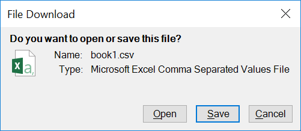

# DownloadFileDialog Component - SHGetFileInfo Example

This example shows how to extract file information including icon and file type name using [`SHGetFileInfo`](https://msdn.microsoft.com/en-us/library/windows/desktop/bb762179.aspx):

When using, you can use the component this way:

	downloadFileDialog1.FileName = filename;
	var result = downloadFileDialog1.ShowDialog();
	if (result == DownloadFileResult.Open)
		// Open the file
	else if (result == DownloadFileResult.Save) 
		// Save the file
	